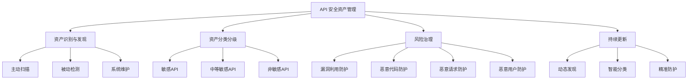
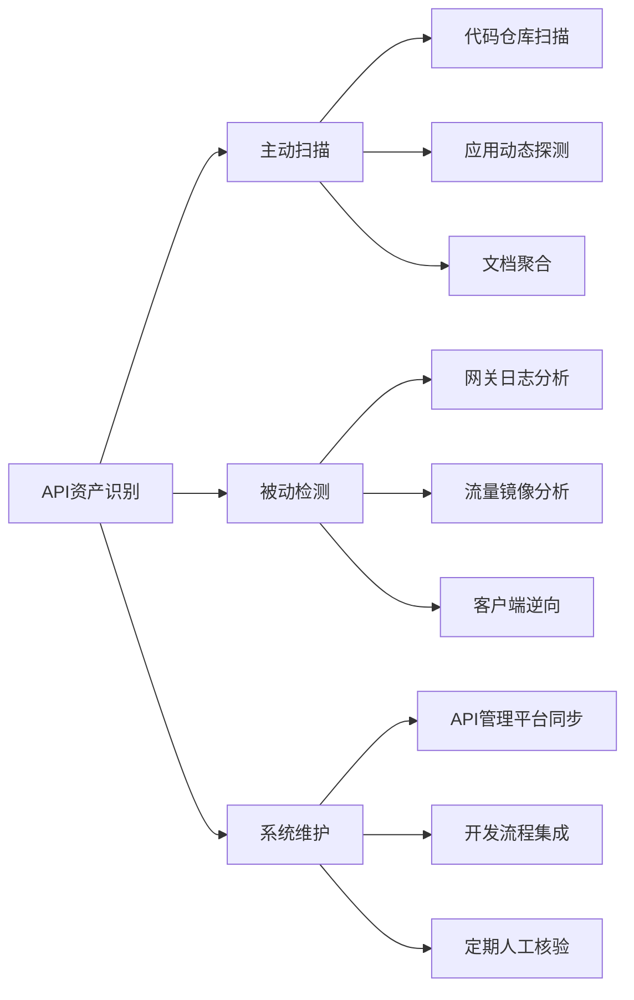
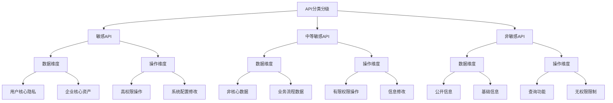
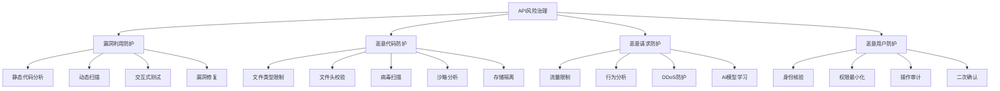
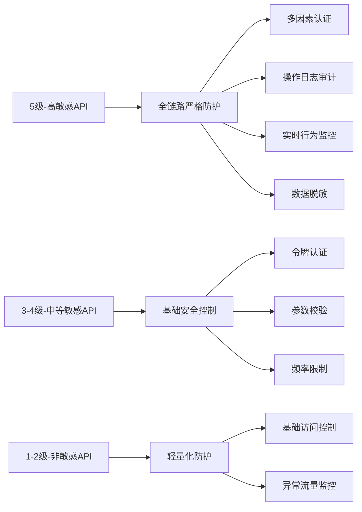
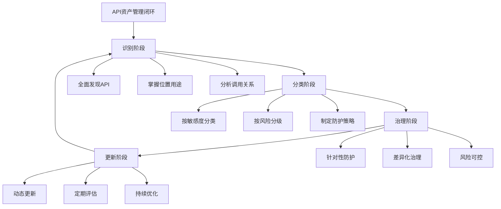
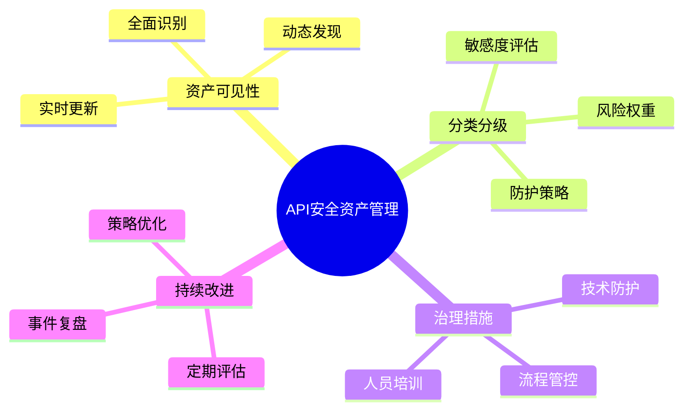

# API 安全资产管理框架图

## 整体框架

## 资产识别与发现流程

## 分类分级体系

## 风险治理策略

## 防护级别对应表

## 闭环管理体系

## 关键成功要素

这个框架图展示了API安全资产管理的完整体系，从资产识别到风险治理，再到持续更新，形成了一个完整的闭环管理流程。每个环节都有具体的实施方法和工具支持，确保API安全防护的有效性和可持续性。

