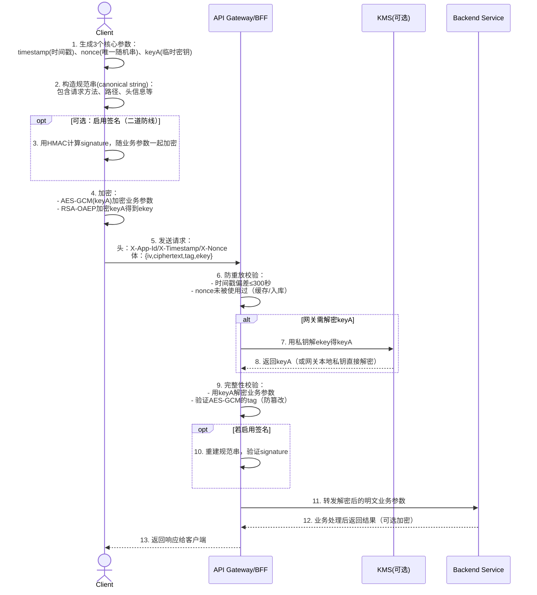

当前 80% 以上的 Web 应用依赖 HTTP/HTTPS 协议构建接口，无论是企业内部的 SDLC（软件开发生命周期）工程师、渗透测试人员，还是白帽黑客，在开展接口测试时，**抓包分析协议**都是首要步骤（也就是常说的 “中间人攻击” 场景）。

在过往的众测项目中，我们发现一个明显规律：如果接口具备基础的 “加密 + 加签” 防护，就能直接阻挡 70% 以上的初级攻击者。虽然没有绝对安全的系统，但一套合理的接口安全设计，能显著提高攻击门槛，大幅降低业务数据泄露、篡改的风险。

## 一、方案目标与适用范围

**1.1 核心目标**

在**强制启用 HTTPS**的基础上，通过 “应用层签名 + 可选加密”，解决以下 4 类核心风险：

- 中间人抓包后篡改参数（如修改订单金额、收款账号）；
- 攻击者重放历史请求绕过幂等校验（如重复提交支付）；
- 抓包后逆向分析接口逻辑，伪造恶意请求；
- 服务间调用时的越权访问或数据泄露。

**1.2 适用场景**

- 对外接口：面向移动端（App）、Web 前端的用户侧接口；
- 对内接口：企业内部微服务间的 HTTP 调用（如 BFF 层到业务层）；
- 不适用场景：纯内部、无网络暴露的本地接口（如单机服务内的进程通信）。

## 二、核心威胁与防护思路

先明确我们要对抗的 “敌人”，再针对性设计方案：

| 威胁类型   | 具体场景                                        | 防护手段                                   |
| ---------- | ----------------------------------------------- | ------------------------------------------ |
| 被动嗅探   | 攻击者抓包获取明文参数，复用请求逻辑            | AES-GCM 加密业务参数                       |
| 主动篡改   | 修改请求中的金额、用户 ID、状态等关键字段       | 签名校验（HMAC/ECDSA）+ AES-GCM 完整性验证 |
| 重放攻击   | 重复发送历史请求（如重复支付、重复下单）        | timestamp 时间窗口 + nonce 唯一值去重      |
| 伪造客户端 | 冒充合法 App/Web 端调用接口（如爬虫、恶意脚本） | 客户端标识（X-App-Id）+ 公钥绑定           |
| 密钥泄露   | 客户端公钥 / 服务端私钥泄露                     | 定期密钥轮换 + 泄露后快速下线机制          |

**防护核心思路**：在 TLS（HTTPS）基础上，叠加 “混合加密 + 重放防护”—— 客户端每次请求生成临时对称密钥，无需存储长期密钥，避免密钥泄露风险。

## 三、方案设计细节

**3.1 核心组件与交互流程**

整个方案涉及 “客户端→API 网关→后端服务” 三个角色，关键交互逻辑如下（配合下方序列图理解更清晰）：

1. **客户端**：生成临时密钥→加密业务参数→提交请求；
2. **API 网关**：校验重放风险→解密参数→验证完整性；
3. **后端服务**：仅处理明文业务，不参与安全逻辑（降低耦合）。

**关键交互序列图（Mermaid）**

**3.2 关键技术规范**

**（1）临时密钥与加密算法**

- **临时对称密钥（keyA）**：客户端每次请求随机生成 32 字节（256 位）字符串，仅用于当前请求，不存储；
- **业务参数加密**：AES-256-GCM 算法（带 12 字节 IV 初始化向量、16 字节 Tag 完整性校验）；
- **密钥加密**：用服务端公钥对 keyA 做 RSA-OAEP-256 加密，得到 ekey（避免 keyA 在传输中泄露）；
- **编码格式**：IV、ciphertext（密文）、tag、ekey 均用 Base64URL 编码（适配 URL 传输）。

**（2）重放防护规则**

- **timestamp**：客户端当前时间（秒级，非毫秒！），格式为 Unix 时间戳；
- **时间窗口**：网关校验 “当前时间 - timestamp ≤ 300 秒”（可配置，超过则拒绝）；
- **nonce**：全局唯一随机串（至少 16 字节，推荐 32 字节），网关需记录已使用的 nonce（缓存 TTL≥300 秒，避免重复）。

**（3）请求头规范（必选）**

| 头字段       | 作用                               | 示例                |
| ------------ | ---------------------------------- | ------------------- |
| X-App-Id     | 客户端标识（区分 App/Web/ 小程序） | app_ios_v2.1.0      |
| X-Timestamp  | 客户端请求时间（秒级）             | 1726800000          |
| X-Nonce      | 唯一随机串（Base64URL）            | aBcD1234efGh5678... |
| Content-Type | 请求体格式                         | application/json    |

**（4）请求体格式（加密后）**

`{  "iv": "Base64URL编码的12字节IV",  "ciphertext": "AES-GCM加密后的业务参数密文",  "tag": "AES-GCM的16字节完整性校验Tag",  "ekey": "RSA-OAEP加密后的keyA（Base64URL）"}`

**3.3 签名机制（可选，二道防线）**

如果业务对安全性要求极高（如金融、支付场景），可在加密基础上额外添加签名（一般场景用 AES-GCM 的 Tag 校验已足够）：

**（1）签名算法与规范串**

- **算法**：HMAC-SHA256（推荐，性能好）或 ECDSA P-256（安全性更高，性能略低）；
- **规范串（canonical string）**：按固定规则构造（避免客户端与服务端规则不一致导致验签失败），格式如下：

`<HTTP_METHOD><请求路径><排序后的Query参数><固定头字段><X-Timestamp><X-Nonce>`

示例（GET 请求）：

`GET/api/v1/order/payamount=100&orderId=123456host:api.example.com;x-app-id:app_ios_v2.1.01726800000aBcD1234efGh5678...`

**（2）验签流程**

1. 网关按上述规则重建规范串；
2. 用客户端对应的密钥（从配置 / 数据库获取）计算签名；
3. 对比客户端提交的 signature（需放在加密的业务参数中），一致则通过。

## 四、落地步骤与分工

**4.1 分阶段落地（降低风险）**

建议分 3 个阶段灰度上线，避免一次性全量切换导致故障：

| 阶段               | 目标             | 操作                                                   | 验证点                                  |
| ------------------ | ---------------- | ------------------------------------------------------ | --------------------------------------- |
| 阶段 1：防重放     | 先解决重放风险   | 网关启用 “X-Timestamp+X-Nonce” 校验，不启用加密 / 签名 | 重放请求被拒绝；正常请求通过率 100%     |
| 阶段 2：完整性校验 | 增加防篡改能力   | 启用 AES-GCM 解密与 Tag 校验，不启用签名               | 篡改密文后请求被拒绝；解密成功率 100%   |
| 阶段 3：全量加密   | 覆盖所有敏感接口 | 对支付、用户信息等接口启用 “加密 + 可选签名”           | 敏感参数抓包后为密文；签名失败率 < 0.1% |

**4.2 角色分工**

- **前端 / 客户端开发**：

1. 内置服务端公钥（避免硬编码，可通过配置中心下发）；
2. 实现 “生成 timestamp/nonce/keyA→加密业务参数→构造请求” 逻辑；
3. 适配不同端（Web 需注意密钥安全，避免被 JS 反爬获取）。

- **网关开发**：

1. 开发 “时间窗口校验 + nonce 去重” 组件（nonce 推荐用 Redis 缓存，支持分布式部署）；
2. 实现 RSA-OAEP 解密 ekey、AES-GCM 解密业务参数的逻辑；
3. 对接 KMS（可选），避免私钥明文存储。

- **安全 / 运维团队**：

1. 生成并管理公钥 / 私钥对（推荐 2048 位以上 RSA 密钥）；
2. 设计密钥轮换方案（如每 3 个月轮换一次）；
3. 搭建监控告警系统（如失败率、时间偏差监控）。

## 五、密钥管理与风险处置

**5.1 密钥生成与分发**

- **公钥**：服务端生成公钥后，内置到客户端（App/Web），或通过/.well-known/jwks.json接口下发（支持动态更新）；
- **私钥**：仅存储在网关或 KMS 中，禁止明文存储（如用 AWS KMS、阿里云 KMS 托管）；
- **密钥标识（kid）**：可选字段，用于区分多套密钥（如新旧密钥过渡期），客户端请求时通过头字段携带（如 X-Key-Id）。

**5.2 密钥轮换与泄露处置**

- **轮换周期**：推荐 3-6 个月轮换一次公钥 / 私钥对；
- **过渡期**：轮换后保留旧密钥 7 天（确保旧客户端仍能正常请求）；
- **泄露处置**：

1. 立即下线泄露的公钥 / 私钥对；
2. 通过配置中心推送新公钥到客户端；
3. 排查是否有恶意请求，若有则封禁 IP / 账号。

## 六、监控、审计与渗透测试

**6.1 核心监控指标**

| 指标类别 | 具体指标                              | 告警阈值                  |
| -------- | ------------------------------------- | ------------------------- |
| 安全校验 | 验签失败率、解密失败率                | 单接口失败率 > 1%         |
| 重放防护 | nonce 冲突次数、时间偏差 > 300 秒次数 | 单 IP 1 分钟内冲突 > 5 次 |
| 密钥使用 | 旧密钥使用率、未知 kid 请求数         | 旧密钥停用后仍有请求      |
| 业务风险 | 敏感接口（如支付）请求量突增          | 较基线增长 > 50%          |

**6.2 审计日志规范**

日志需包含以下信息（避免记录明文业务参数）：

- 请求时间、客户端 IP、X-App-Id、X-Timestamp、X-Nonce；
- 规范串哈希（如 SHA-256）、失败原因（如 “时间偏差过大”“nonce 重复”）；
- kid（若启用）、接口路径、HTTP 状态码。

**6.3 渗透测试检查清单**

落地后需通过渗透测试验证效果，核心检查项如下：

1. 重放测试：重复发送同一请求，是否被网关拒绝；
2. 篡改测试：修改密文中的业务参数，是否触发 Tag 校验失败；
3. 时间偏差测试：调整客户端时间（如 + 400 秒），是否被拒绝；
4. 密钥轮换测试：停用旧密钥后，旧客户端是否无法请求；
5. 规范串一致性测试：空 body、重复 Query 参数（如？a=1&a=2）场景下，验签是否通过。

## 七、常见坑与避坑指南

在过往落地项目中，我们总结了 4 个高频问题，务必避免：

| 常见坑                       | 后果                           | 避坑方案                                                                                   |
| ---------------------------- | ------------------------------ | ------------------------------------------------------------------------------------------ |
| 客户端与网关规范串规则不一致 | 验签失败，正常请求被拒绝       | 制定详细的规范串文档，包含空格、编码、排序规则（如 Query 参数按 key 升序），前后端严格对齐 |
| 时间戳单位错误               | 时间偏差过大，请求被拒绝       | 明确时间戳为**秒级**（非毫秒），客户端与网关均用 UTC 时间（避免时区问题）                  |
| nonce 重复或未存储           | 无法防御重放攻击               | nonce 需至少 16 字节随机串，网关用 Redis 存储已使用的 nonce（TTL≥300 秒），支持分布式部署  |
| 加密与签名未绑定             | 攻击者替换密文后仍可能通过验签 | 用 AES-GCM 的 AAD（附加认证数据）绑定规范串（如 timestamp、nonce），确保密文与上下文关联   |

## 八、性能与兼容性考量

**8.1 性能开销**

- **加密 / 解密**：AES-GCM 支持硬件加速（如 Intel AES-NI），单请求加密耗时 < 1ms；HMAC-SHA256 计算耗时 < 0.1ms，整体性能影响可忽略；
- **nonce 去重**：用 Redis 缓存 nonce，单次查询耗时 < 1ms（推荐用 Redis Cluster，支持高并发）。

**8.2 兼容性适配**

- **Web 端**：需注意浏览器对 AES-GCM 的支持（IE11 及以下不支持，推荐用 CryptoJS 库兼容）；
- **移动端**：iOS 用 CommonCrypto 库，Android 用 javax.crypto 库，避免自定义加密逻辑；
- **旧系统**：若后端服务无法快速适配，可在网关层做 “新旧接口兼容”（如给旧接口加白名单，逐步迁移）。

## 九、小结

API 接口安全的核心不是 “追求绝对安全”，而是 “提高攻击成本”—— 通过 “TLS + 混合加密 + 重放防护 + 密钥轮换” 的组合方案，能以较低的开发成本，显著抵御大部分常见攻击（如篡改、重放、嗅探）。

落地时需注意：**先灰度验证，再全量上线**，同时做好监控与密钥管理，避免因规则不一致、密钥泄露导致安全风险。
